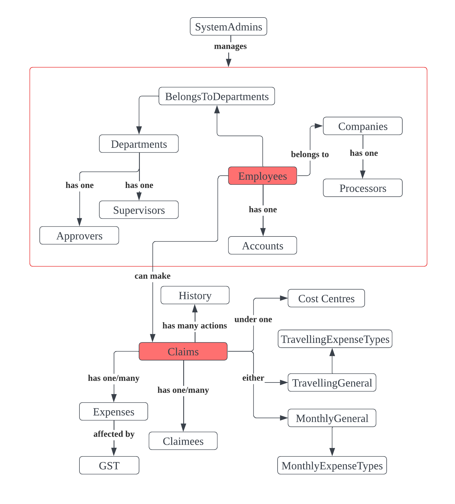
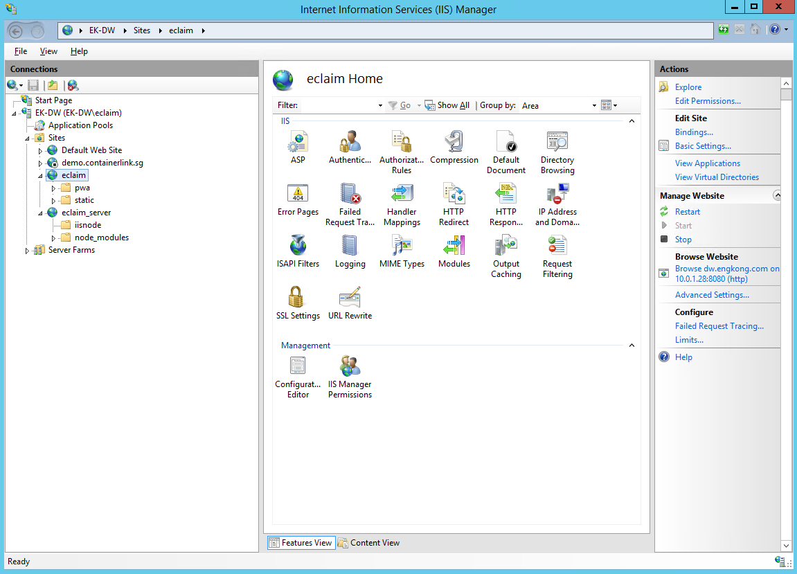

# Developer Documentation

## Overview
This eclaim application developed for Eng Kong is a cross-platform web application that digitalises and streamlines the company's claim handling process. Currently, users are able to use the application on both web and mobile platforms, as long as they are connected to Eng Kong's VPN or their private network. This guide aims to provide you with all the necessary information to understand, use, and contribute to this application effectively.

## Table of Contents
- [System Architecture](#system-architecture)
    - [Frontend](#frontend)
    - [Backend](#backend)
    - [Database](#database)
    - [Communication Flow](#communication-flow)
    - [Security](#security)
- [Getting Started](#getting-started)
    - [Installation](#installation)
    - [Ports](#ports)
    - [Usage](#usage)
- [Contributing](#contributing)
- [Troubleshooting](#troubleshooting)
- [Changelog](#changelog)
- [Appendix](#appendix)

## System Architecture

### Frontend  
The frontend of our application is developed using __React Native__, providing a web app interface for our users. This client-side component is responsible for rendering the user interface and handling user interactions. It communicates with the Express.js backend through __HTTP requests__ to fetch and send data.

### Backend  
Our backend is built on __Node.js with Express.js__ as the web application framework. It serves as the server-side component of our system. The Express.js backend exposes various __API endpoints__ that the frontend can interact with. The backend handles HTTP requests from the frontend, processes data, and __interacts with the Microsoft SQL Server__ database to get and update data. The backend is the __bridge__ between the frontend and the database, ensuring seamless communication and data management.

### Database  
We utilize __Microsoft SQL Server__ as our database to store and manage the application's data. The backend, built with Express.js, communicates with the database to perform __CRUD operations__ (Create, Read, Update, Delete) based on frontend requests. The diagram below shows how our database entities and their relationships are modelled. Please refer to the data dictionary for more information on the schema.

_Entity-Relationship Diagram_

### Communication Flow
The communication between the React Native frontend, Express.js backend, and SQL database follows a __standard HTTP request-response cycle__. When a user interacts with the frontend, it sends HTTP requests to the Express.js backend with relevant data. The backend processes the request and communicates with the database if necessary. After processing, the backend sends an HTTP response back to the frontend with the requested data or an appropriate acknowledgement. This data is then displayed on the frontend interface where the user is able to see and use.

### Security  
#### JWT authentication
We have implemented JSON Web Token (JWT) authentication on the backend Node.js server to secure the API endpoints and control access to sensitive resources. JWT authentication allows users to obtain a token upon successful login, and subsequent requests must include this token to gain access to protected routes. The token is signed with a secret key only known to the server to prevent tampering. Once the frontend client receives the token, it is stored in the window localStorage. For subsequent requests, the backend validates the token using the secret key and if it is valid, the user will be authorised to access the protected routes and its resources.

#### Express.js middleware  
All API endpoints requiring authentication are protected using middleware that verifies the presence and validity of the JWT. If token is invalid, the user will be denied access. Do take note that the token will also expire and user will be logged out automatically once token has expired.

#### Randomised Claim ID  
To make it harder for employees to join claims inappropriately, we used a random generator to generate random alphanumeric claim IDs when a new claim is being created.

## Getting Started

This section will help you get started with the Web Application. It includes the prerequisites, installation instructions, and basic usage examples.

### Prerequisites

Before you start using Eclaim Web App, make sure you have the following installed:

1. **Node.js and npm**: Install Node.js and npm (Node Package Manager) on your machine. You can download the latest version from the official Node.js website: [https://nodejs.org](https://nodejs.org)

2. **React Native CLI**: Install the React Native command-line interface (CLI) globally on your system:

        npm install -g react-native-cli

3. **Expo CLI**: Install the Expo command-line interface (CLI) globally on your system:

        npm install -g expo-cli

## Installation

To install Eclaim Web App, follow these steps:

1. **Fork the Repository**: Fork the repository from [https://github.com/engkongit/eclaim](https://github.com/engkongit/eclaim) then clone it to your local desktop

        git clone https://github.com/YOURREPO/eclaim.git
        cd eclaim

2. **Install Dependencies for Web App**: A node modules folder should be created in client folder

        npm install
        cd server

3. **Install Dependencies for Server**: A node modules folder should be created in server folder

        cd server
        npm install

## Ports

Before starting with the usage, there are important ports that needs to be adressed in order to fully understand what is being hosted.

1. **`10.0.1.28:8080`** This is the port used on IIS(Internet Information Services) to host the front-end.
    - Mapped to `dw.engkong.com:8080`  
     

2. **`10.0.1.28:5000`** This is the port used on IIS to host the back-end
    - Mapped to `dw.engkong.com:5000`  
         

3. **`localhost:1906`** This is the port typically used when hosting the front-end on the local computer

4. **`localhost:5000`** This is the port typically used when hosting the back-end on the local computer

## Usage

In this section, we'll cover how to use Eclaim Web App. Provide code examples and explanations for the 2 different use cases.

### Example 1: Run Both Front-End and Back-End Locally

This is for Back-End Development where there are changes to server.js.

1. **Change All Headers in Front-End**:
   Since all the headers in the front-end are configured to `dw.engkong.com`, which is the private EngKong IP address, they need to be changed back to `localhost`.

   - Open Visual Studio Code (VSC).
   - Navigate to the `menu` typically located on the left.
   - Select `Search` from the menu then select the `Right Chevron Icon`, or use the shortcut `Ctrl + Shift + H` (Windows) or `Cmd + Shift + H` (Mac).
   - In the "Find" field, type `dw.engkong.com:5000`.
   - In the "Replace" field, type `localhost:5000`.
   - Click on the "Replace All" button to replace all occurrences.

        

   This will update all the headers in the front-end code to use `localhost` instead of `dw.engkong.com`.

2. **Run Front-End**: 

        cd client
        npm run dev

3. **Run Back-End**: 

        cd server
        expo web

4. **Alternatively, Run Both Together**:

        cd client
        npm run dev

5. **Open Website**:

    Open a web browser and navigate to the following link: [http://localhost:19006/](http://localhost:19006/).

### Example 2: Run Front-End Locally Only

This is usually for Front-End Development where there are changes only to files in client. The client fetches from the server hosted by EngKong (`dw.engkong.com:5000`)

1. **Headers in Front-End**:
   Ensure that all the headers in the front-end are configured to `dw.engkong.com:5000` and not `localhost:5000`.

2. **Run Front-End**: 

        cd client
        expo web

3. **Open Website**:

    Open a web browser and navigate to the following link: [http://localhost:19006/](http://localhost:19006/).

## Contributing

This section will go through the steps taken to contribute to the code on GitHub and update the front and back end code in IIS(Internet Information Services)

### Step 1: Contribute to GitHub

1. **Open a Pull Request**:

    - Go to your forked repository on GitHub. Click on the "Compare & pull request" button next to your latest commit.
    - Review the changes in the pull request and add any necessary details or comments.  
     

2. **Submit the Pull Request**:

    - Click on the "Create pull request" button.
    - Your pull request will now be submitted to the original repository.  
     

3. **Handling Merge Conflicts**:
    - If there are merge conflicts between your pull request and the original repository, resolve them in code editor or GitHub's online code editor

### Step 2: Export and Locate Code

1. **Export Web-Build**: Before updating the Front-End code on IIS, you need to create a production build of the web application. To do this, follow these steps:
    - Open a terminal or command prompt in the Front-End directory of your project.
    - Run the following command to create a production build:
    
            cd client
            npx expo export:web 
    - A Web-Build folder should be created if it does not exist. Otherwise, the folder will be updated.

2. **Locate Back-End Files Changed**: Before updating the Back-End code on IIS, you need to locate the files that have been changed. To do this, follow these steps:
    - Open up file explorer and locate and open the eclaim folder.
    - Open the server folder,  `/eclaim/server`
    - Based on what files had been changed in this folder, these will be the relevant files that need to be copied later on. This will typically be `server.js`

### Step 3: Update Front-End and Back-End Code on IIS
1. **Connect to EngKong PC With Remote Desktop**:In order to update the Front-End and Back-End code on IIS, you need to access the EngKong PC using Remote Desktop Connection. Follow these steps to connect:
    - Ensure you have the necessary credentials to access the EngKong PC via Remote Desktop.
    - On your local machine, search for "Remote Desktop Connection" in the start menu and open the application.
    - In the Remote Desktop Connection window, enter the IP address or the hostname of the EngKong PC in the "Computer" field. It should be `10.0.1.28`

        
    - Click the "Connect" button to initiate the connection.
    - When prompted, enter your credentials (username and password) to log in to the EngKong PC.
    - Once connected, you will have remote access to the EngKong PC's desktop and can perform administrative tasks.
        
        

2. **Access IIS Manager**:

    - Open File Explorer
    - Navigate to `C:\inetpub\wwwroot`
    - In this directory, there you should be able to locate folders: `eclaim` and `eclaim_server`
        

3. **Update Front-End Files**:
    - From Step 2.1(Export Web Build), copy all files within web-build folder on your local computer
    
    - Paste the files into the eclaim folder on the remote desktop
    

4. **Update Back-End Files**:
    - From Step 2.2(Locate Back-End Files Changed), copy all files changed within server folder on your local computer, typically `server.js`
    
    - Paste the files into the eclaim_server folder on the remote desktop
    

5. **Restart Server**:
    - Find and open the Internet Information Services (IIS) Manager.
    - Locate the `eclaim` and `eclaim_server` applications 
    - Click `Restart` at the right side of the page 
    

6. **View Changes**:
    - On your local desktop, use a web browser with Javascript enabled to access `dw.engkong.com`
    - If the steps have been followed without error, the changes made should be able to be seen

## Appendix  

### Target user  
* Employees of Eng Kong who are mostly office or blue collared workers.

### Product Scope  
* App digitalises current claim handling process but Finance department still has to do internal processing of claims

### Target user Profile
* User can understand basic English
* Supervisor finds it troublesome to submit claims on behalf of employees
* User is familiar with using mobile phones and desktop computers for work
* User finds whole process of claim handling time-consuming

### Value proposition  
Our eclaim web app is a one-stop, cross-platform application that digitalises and speeds up the claiming process of Eng Kong by making use of email notification, claim joining, receipt uploading and data conversion features. This makes it so much easier for users at every step of the claiming process, be it for claimants, approvers or processors.

### Non-Functional Requirements
* Should work on any mainstream OS
* Should be able to hold up to 1000 claims without a noticeable sluggishness in performance for typical usage.
* Notes on project scope: The application does not replace the internal processing of the claims by Finance department.
* The system should respond within 3 seconds.
* Internet connection is required and currently users can only use it within the local private network.

